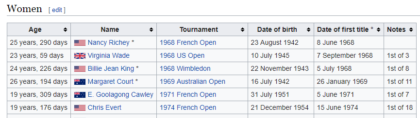

tennis data
================
DanielH
26/04/2019

  - [women’s slams records](#womens-slams-records)
  - [men slams records](#men-slams-records)
  - [dates of birth for women](#dates-of-birth-for-women)
  - [dates of birth for men](#dates-of-birth-for-men)
  - [Total Combine](#total-combine)
  - [](#section)

``` r
library(tidyverse)
library(rvest)
library(lubridate)
library(janitor)
```

We want to pratice some data cleaning functions from several R packages.
For this purpose we will use data from Wikipedia. The data is about top
tennis tournaments, the so called Grand Slams, the when, where winners
and so on. The data imported from wikipedia is not in a tidy format. We
will have to tidy it.

-----

### women’s slams records

The table from wikipedia
“<https://en.wikipedia.org/wiki/List_of_Grand_Slam_women%27s_singles_champions>”
looks like this:


As we can see the data is not tidy. We need the tournament name in one
col and the winner’s name in another column. We also want to remove
unnecessary symbols, remove, split and put somewhere the victory
count(here between parentheses) Plus we want to filter out all data
before 1968

``` r
# get raw table
raw_slams_women <-
  "https://en.wikipedia.org/wiki/List_of_Grand_Slam_women%27s_singles_champions" %>%
  read_html() %>%
  html_table(fill = TRUE) %>%
  .[[3]]


# clean table
slams_women <-
  raw_slams_women %>%
  filter(Year >= 1968) %>% 
  gather("grand_slam", "winner", -Year) %>%
  mutate(winner = str_remove(winner, "‡"),
         winner = str_remove(winner, "Open era tennis begins|Tournament date changed|Amateur era tennis ends"),
         winner = str_replace_all(winner,
                                  c("Arantxa Sánchez Vicario"  = "Arantxa Sanchez Vicario",  # replace
                                  "Conchita Martínez" = "Conchita Martinez",                # problematic
                                  "Amélie Mauresmo" = "Amelie Mauresmo",                   # names
                                  "Garbiñe Muguruza" = "Garbine Muguruza",                # containing
                                  "Chris O'Neil" =" Chris ONeil")),                       # accents and
         winner = if_else(Year == 2017 & grand_slam == "French Open", "Jelena Ostapenko", winner),
         winner = if_else(Year == 1978 & grand_slam == "Australian Open", "Chris ONeil", winner),
         winner = str_trim(winner),
         win_count = str_extract(winner, "\\([:digit:]+[:punct:][:digit:]+\\)"),
         winner = str_extract(winner,"[A-Z][a-z]+\\s[A-Z][a-z]+(\\s[A-Z][a-z]+)?"),
         win_count = str_remove(win_count, "\\("),
         win_count = str_remove(win_count, "\\)")) %>%
  separate(win_count, into = c("rolling", "overall"), sep = "/") %>%
  clean_names() %>% 
  filter(winner > 4) %>%
  mutate(tournament_date = case_when(grand_slam == "Australian Open" ~ paste0(year, "-01-10"),
                                     grand_slam == "French Open" ~ paste0(year, "-06-09"),
                                     grand_slam == "US Open" ~ paste0(year, "-09-09"),
                                     grand_slam == "Wimbledon" ~ paste0(year, "-07-14"),
                                     TRUE ~ NA_character_),
         tournament_date = lubridate::ymd(tournament_date),
         gender = "Female") %>%
  group_by(winner) %>% 
  arrange(tournament_date) %>% 
  mutate(rolling = row_number()) %>% 
  ungroup() 


slams_women %>%
  sample_n(4)
```

    ## # A tibble: 4 x 7
    ##    year grand_slam    winner         rolling overall tournament_date gender
    ##   <int> <chr>         <chr>            <int> <chr>   <date>          <chr> 
    ## 1  1989 French Open   Arantxa Sanch~       1 4       1989-06-09      Female
    ## 2  1985 US Open       Hana Mandl           3 4       1985-09-09      Female
    ## 3  1985 Australian O~ Martina Navra~      12 18      1985-01-10      Female
    ## 4  2016 Wimbledon     Serena Willia~      22 23      2016-07-14      Female

The table is now clean, it’s a tidy dataset.

-----

### men slams records

The table from wikipedia
“<https://en.wikipedia.org/wiki/List_of_Grand_Slam_women%27s_singles_champions>”
looks like this:


We now want to do the same with men records, even though for our purpose
we will use a slightly different approach focusing more on tidyr
functions and slightly less on regex and stringr functions

``` r
# read in raw data for men
raw_slams_men <-
  "https://en.wikipedia.org/wiki/List_of_Grand_Slam_men%27s_singles_champions" %>%
  read_html() %>%
  html_node(xpath = '//*[@id="mw-content-text"]/div/table[1]') %>% 
  html_table() %>%
  clean_names()

slams_men <-
  raw_slams_men %>%
  filter(year > 1968) %>%
  gather("grand_slam", "winner", -year) %>% 
  separate(winner, into = c("winner", "win_count"), sep = "\\(") %>%
  mutate(win_count = str_remove(win_count, "\\)"),
         win_count = str_remove(win_count, "†+")) %>%
  separate(win_count, into = c("rolling_win_count", "total_win_count"), sep = "/") %>%
  separate(col = winner, into = c("country", "winner"), sep = ":", fill = "left") %>%
  mutate(rolling_win_count = str_extract(rolling_win_count, "[:digit:]+")) %>%
  mutate(winner = str_remove(winner, "†+"),
         winner = str_remove(winner, "Amateur era tennis ends|Open era tennis begins|Tournament date changed"),
         winner = str_trim(winner),
         winner = parse_character(winner, na = c("", NA))) %>%
  filter(str_length(winner) > 4) %>%
  mutate(tournament_date = case_when(grand_slam == "australian_open" ~ paste0(year, "-01-10"),
                                     grand_slam == "french_open" ~ paste0(year, "-06-09"),
                                     grand_slam == "us_open" ~ paste0(year, "-09-09"),
                                     grand_slam == "wimbledon" ~ paste0(year, "-07-14"),
                                     TRUE ~ NA_character_),
         tournament_date = lubridate::ymd(tournament_date),
         gender = "Male") %>% 
  select(-country) %>%
  group_by(winner) %>% 
  arrange(tournament_date) %>% 
  mutate(rolling_win_count = row_number()) %>% 
  ungroup()
```

-----

### dates of birth for women

This table got the majority of women but we had to manually add
birthdates for Ann and Chris.



``` r
# get raw table
dob_women_raw <-
  "https://en.wikipedia.org/wiki/List_of_Grand_Slam_singles_champions_in_Open_Era_with_age_of_first_title" %>%
  read_html() %>%
  html_table(fill = TRUE) %>%
  .[[2]] %>%
  clean_names()


# clean data
dob_women <-
  dob_women_raw %>%
  mutate(age = str_sub(age, 21),
         name = str_remove(name, "[:punct:]"),
         year =  str_extract(tournament, "[:digit:]+"),
         year = as.numeric(year),
         tournament = str_remove(tournament, "[:digit:]+"),
         date_of_birth = dmy(date_of_birth),
         date_of_first_title = dmy(date_of_first_title)) %>%
  select(1:3, year, everything())


dob_women %>%
  sample_n(4)
```

    ##                  age                name       tournament year
    ## 1  20 years, 13 days         Mary Pierce  Australian Open 1995
    ## 2  19 years, 76 days Svetlana Kuznetsova          US Open 2004
    ## 3 26 years, 255 days        Simona Halep      French Open 2018
    ## 4 20 years, 319 days       Mima Jaušovec      French Open 1977
    ##   date_of_birth date_of_first_title    notes
    ## 1    1975-01-15          1995-01-28 1st of 2
    ## 2    1985-06-27          2004-09-11 1st of 2
    ## 3    1991-09-27          2018-06-09         
    ## 4    1956-07-20          1977-06-04

We now combine the dob table for women `dob_women` with the table for
women slams, `slams_women`

``` r
age_slams_w <-
  slams_women %>%
  rename(name = 3) %>% 
  left_join(dob_women, by = c("name")) %>%
  mutate(age = tournament_date - date_of_birth) %>%
  group_by(name, age) %>% 
  summarize(counts = n()) %>% 
  group_by(name) %>% 
  mutate(total_wins = cumsum(counts)) %>% 
  arrange(desc(total_wins))

age_slams_w %>%
  ungroup() %>% 
  sample_n(4)
```

    ## # A tibble: 4 x 4
    ##   name            age       counts total_wins
    ##   <chr>           <time>     <int>      <int>
    ## 1 Serena Williams 7561 days      1          2
    ## 2 Naomi Osaka     7756 days      1          2
    ## 3 Steffi Graf     7392 days      1          8
    ## 4 Maria Sharapova 9183 days      1          4

-----

### dates of birth for men


``` r
# get raw data
dob_men_raw <-
  "https://en.wikipedia.org/wiki/List_of_Grand_Slam_singles_champions_in_Open_Era_with_age_of_first_title" %>%
  read_html() %>%
  html_table(fill = TRUE) %>%
  .[[1]] %>%
  janitor::clean_names()


# clean data
dob_men <-
  dob_men_raw %>%
  mutate(age = str_sub(age, 21),
         name = str_remove(name, "[:punct:]")) %>%
  mutate(year = str_extract(tournament, "[:digit:]{4}"),
         year = as.numeric(year),
         tournament = str_remove(tournament,  "[:digit:]{4}"),
         tournament = str_remove(tournament, "\\([A-Z][a-z]+\\)"),
         tournament = str_trim(tournament),
         date_of_birth = dmy(date_of_birth),
         date_of_first_title = dmy(date_of_first_title)) %>%
  select(1:3, year, everything())

dob_men %>%
  sample_n(4)
```

    ##                  age            name      tournament year date_of_birth
    ## 1 25 years, 340 days Adriano Panatta     French Open 1976    1950-07-09
    ## 2 33 years, 220 days   Ken Rosewall      French Open 1968    1934-11-02
    ## 3   30 years, 9 days      Petr Korda Australian Open 1998    1968-01-23
    ## 4 22 years, 142 days  Sergi Bruguera     French Open 1993    1971-01-16
    ##   date_of_first_title    notes
    ## 1          1976-06-14         
    ## 2          1968-06-09 1st of 4
    ## 3          1998-02-01         
    ## 4          1993-06-07 1st of 2

We now combine the dob table for women `dob_women` with the table for
women slams, `slams_women`

``` r
age_slams_m <-
  slams_men %>%
  rename(name = 3) %>%
  left_join(dob_men, by = c("name")) %>%
  mutate(age = tournament_date - date_of_birth) %>%
  group_by(name, age) %>% 
  summarize(counts = n()) %>% 
  group_by(name) %>% 
  mutate(total_wins = cumsum(counts)) %>% 
  arrange(desc(total_wins))


age_slams_m %>%
  ungroup() %>% 
  sample_n(4)
```

    ## # A tibble: 4 x 4
    ##   name           age        counts total_wins
    ##   <chr>          <time>      <int>      <int>
    ## 1 Sergi Bruguera  8545 days      1          2
    ## 2 Björn Borg      6577 days      1          1
    ## 3 Björn Borg      8073 days      1          7
    ## 4 Novak Djokovic 10095 days      1          8

### Total Combine

``` r
#slams for both genders
grand_slams <- 
  slams_women %>%
    bind_rows(slams_men) %>% 
    select(-total_win_count)


# player dob for both genders
player_dob <- 
  dob_women %>%
    bind_rows(dob_men)

set.seed(341)
player_dob %>%
   sample_n(2)
```

    ##                  age             name      tournament year date_of_birth
    ## 1 17 years, 357 days      Steffi Graf     French Open 1987    1969-06-14
    ## 2 26 years, 310 days Thomas Johansson Australian Open 2002    1975-03-24
    ##   date_of_first_title     notes
    ## 1          1987-06-06 1st of 22
    ## 2          2002-01-28

``` r
#age slams for both genders
age_slams_comb <-
  grand_slams %>%
  rename(name = 3) %>% 
  left_join(player_dob, by = c("name")) %>%
  mutate(age = tournament_date - date_of_birth) %>%
  group_by(name, age, gender) %>% 
  summarize(counts = n()) %>% 
  group_by(name) %>% 
  mutate(total_wins = cumsum(counts)) %>% 
  arrange(desc(total_wins))
```

## 

-----

Test a regualr expression to extract a 4-letter name

``` r
"Juan Martin Del Potro" %>%
  str_extract("[A-Z][a-z]+\\s[A-Z][a-z]+\\s[A-Z][a-z]+\\s[A-Z][a-z]+")

"Juan Martin Del Potro" %>% 
str_extract("([A-Z][a-z]+\\s){1,3}([A-Z][a-z]+)?")


"(\\s[A-Z][a-z][a-z]+)*"
```
